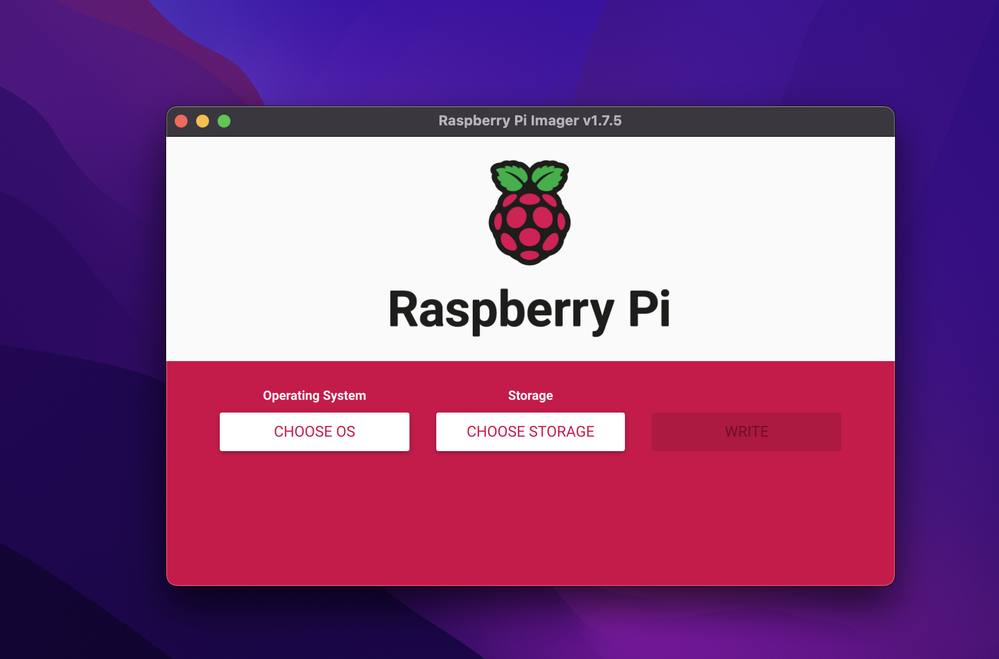
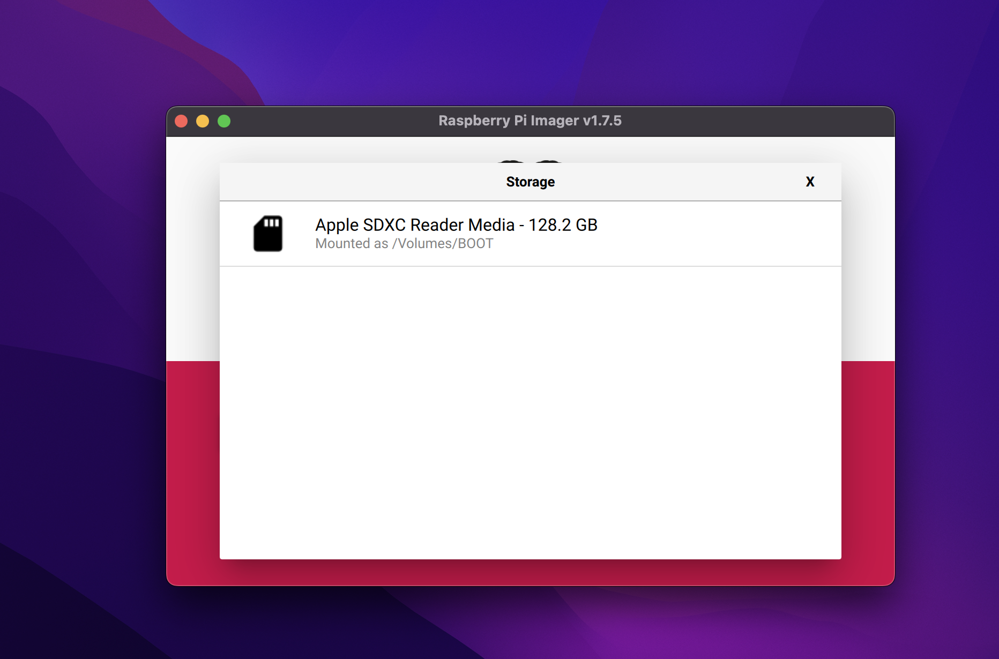
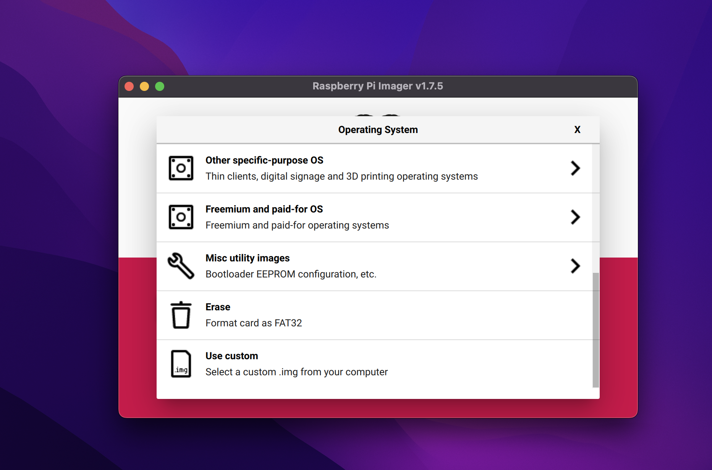
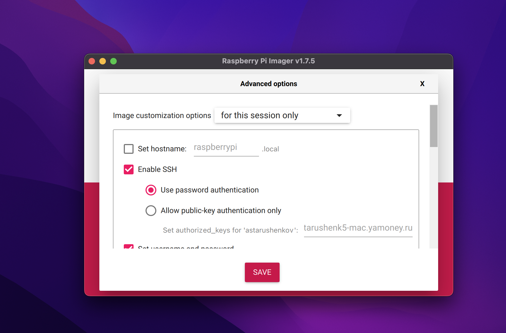
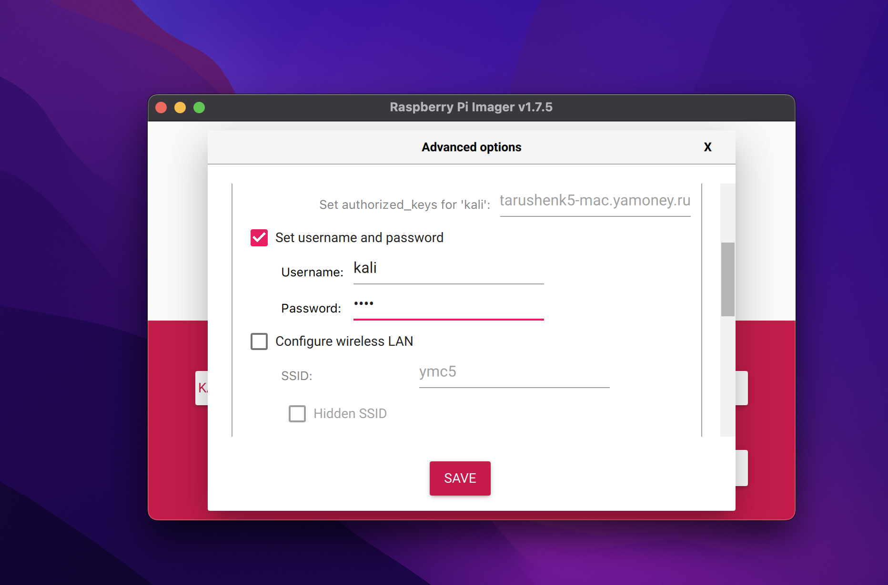
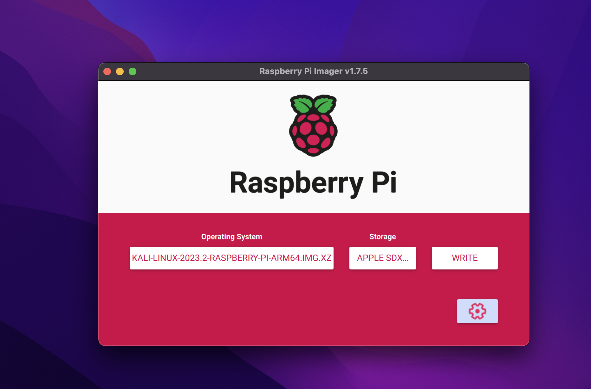
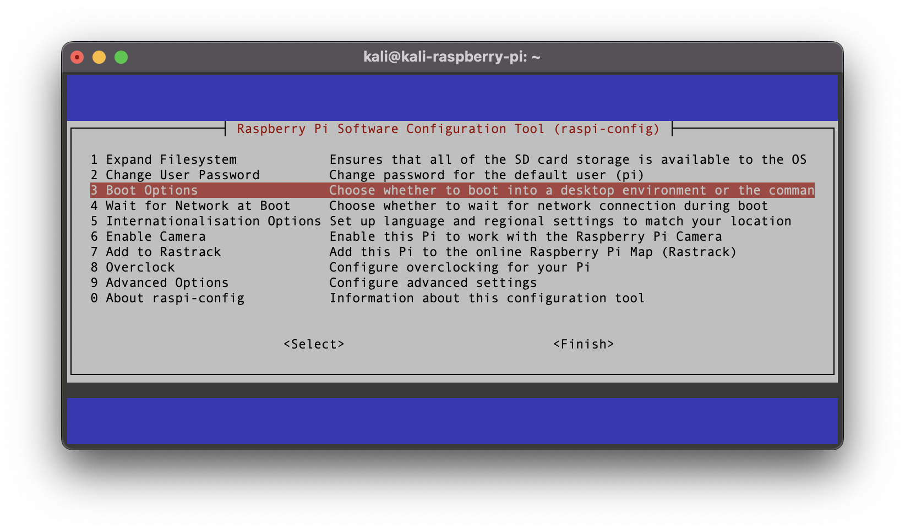

# Fake Access Point

### To Do

- [ ] Description
- [x] Install Ubuntu Server on SD
- [ ] Change system boot options ?
- [x] Install wi-fi driver
- [x] Install aircrack
- [x] Install berate_ap
- [ ] Set up Management Access Point (MAP)
- [ ] Set up Fake Access Point (FAP)
- [ ] Set up launch on boot MAP and FAP

### Hardware
* Raspberry Pi 5 8gb
* Argon NEO 5 BRED
* Micro SD Samsung EVO Plus 128
* Alfa Network awus036ACS

### Software
* [download](https://cdimage.ubuntu.com/releases/24.04/release/ubuntu-24.04-preinstalled-server-arm64+raspi.img.xz?_gl=1*1bkg0hr*_gcl_au*MjI5NzEwNDYyLjE3MTU0MzcxMTA.&_ga=2.213393364.1936330009.1715437667-24952542.1715437667) Ubuntu Server
* [download](https://www.raspberrypi.com/software/) Raspberry Pi Imager

## Preparation

> [!IMPORTANT]
> The whole scheme works on the components and versions I specified. If you are using other components or versions of the software, troubleshooting will be your responsibility.

### Write Ubuntu on SD

via Raspberry Pi Imager 

#### Step 1: Component Selection

* Raspberry Pi Device = Raspberry Pi 5
* Operating System = Use Custome > ubuntu-24.04-preinstalled-server-arm64+raspi.img.xz
* Storage = Mass Storage Device Media - 128.2 GB






#### Step 2: Custom Settings

> [!TIP]
> I don't configure WLAN because it doesn't work. In the future I will connect the RPi to my macbook directly using an Ethernet cable.

Here are the custom settings I make: 

* hostname
* username and password
* locale
* enable ssh
* disable telemetry





#### Step 3: Connection to RPi 

As I said earlier, I will connect to the RPi via an Ethernet cable directly from my macobook.

Before you can connect, you must complete the steps in [THESE INSTRUCTIONS](https://raspberrypi-guide.github.io/networking/create-direct-ethernet-connection).

> [!WARNING]
> I have seen cases where custom settings are ignored and the system is created with ubuntu:ubuntu credentials. Therefore, if you cannot log in with the credentials you specified, use ubuntu:ubuntu.

## Install the software

#### Step 4: Update & Upgrade

First of all, let's update the current packages.

```
sudo apt update && sudo apt upgrade -y
```

#### Step 5: RTL8812AU


Source: https://github.com/aircrack-ng/rtl8812au

```
sudo apt install dkms linux-headers-6.8.0-1004-raspi wireless-tools -y
```
```
git clone -b v5.6.4.2 https://github.com/aircrack-ng/rtl8812au.git
```
```
cd rtl*
```
```
sed -i 's/CONFIG_PLATFORM_I386_PC = y/CONFIG_PLATFORM_I386_PC = n/g' Makefile
```
```
sed -i 's/CONFIG_PLATFORM_ARM64_RPI = n/CONFIG_PLATFORM_ARM64_RPI = y/g' Makefile
```
```
export ARCH=arm64
```
```
sed -i 's/^MAKE="/MAKE="ARCH=arm64\ /' dkms.conf
```
```
sudo make dkms_install
```
```
sudo reboot
```

#### Step 6: AIRCRACK

Source: https://github.com/aircrack-ng/aircrack-ng

```
sudo apt install build-essential autoconf automake libtool pkg-config libnl-3-dev libnl-genl-3-dev libssl-dev ethtool shtool rfkill zlib1g-dev libpcap-dev libsqlite3-dev libpcre2-dev libhwloc-dev libcmocka-dev hostapd wpasupplicant tcpdump screen iw usbutils expect
```
```
git clone https://github.com/aircrack-ng/aircrack-ng.git
```
```
cd air*
```
```
autoreconf -i
```
```
./autogen.sh
```
```
./configure
```
```
make
```
```
sudo make install
```

#### Step 7: BERATE_AP

Source: https://github.com/sensepost/berate_ap

```
sudo apt install haveged dnsmasq -y
```
```
git clone https://github.com/sensepost/berate_ap
```
```
cd ber*
```
```
make install
```