# Fake Access Point
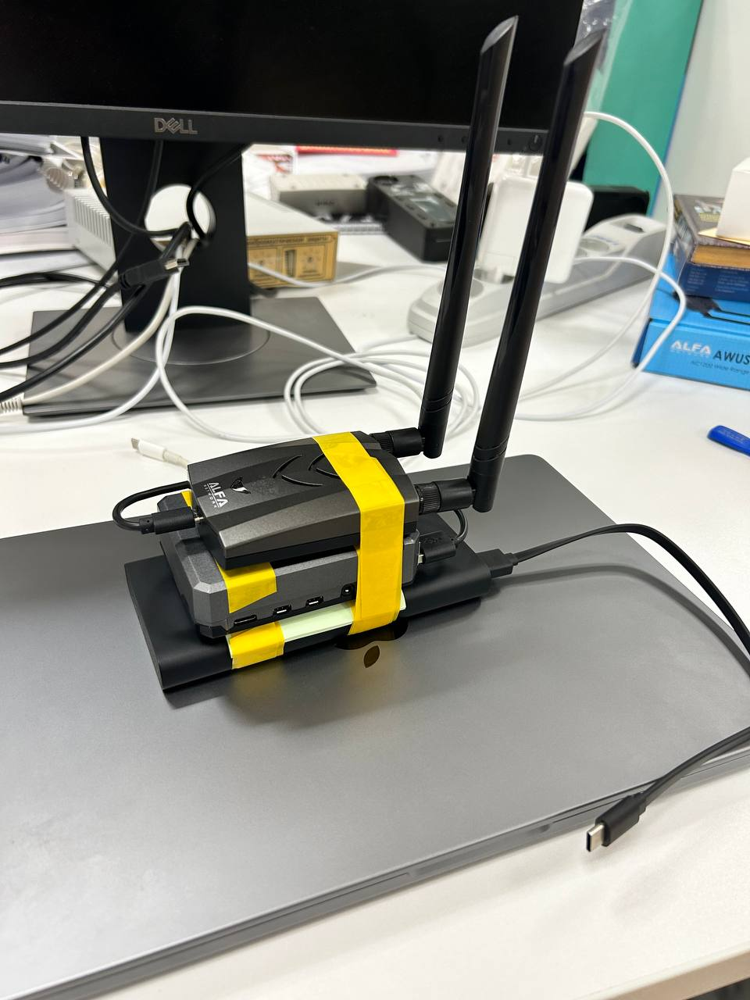

## Hardware

* Raspberry Pi 4 Model B 8GB
* Argon Neo case
* Alfa Network AWUS036ACH-C
* Samsung PRO Plus microSDXC 128Gb

## Software

* berate_ap (https://www.kali.org/tools/berate-ap/)

## Installing Kali Linux on Raspberry-Pi

Download Kali Linux image: https://www.kali.org/get-kali/#kali-arm

Download Raspberry-Pi Imager: https://www.raspberrypi.com/software/

Open the Raspberry-Pi Imager application.


Click `CHOOSE STORAGE` and select our SD card.
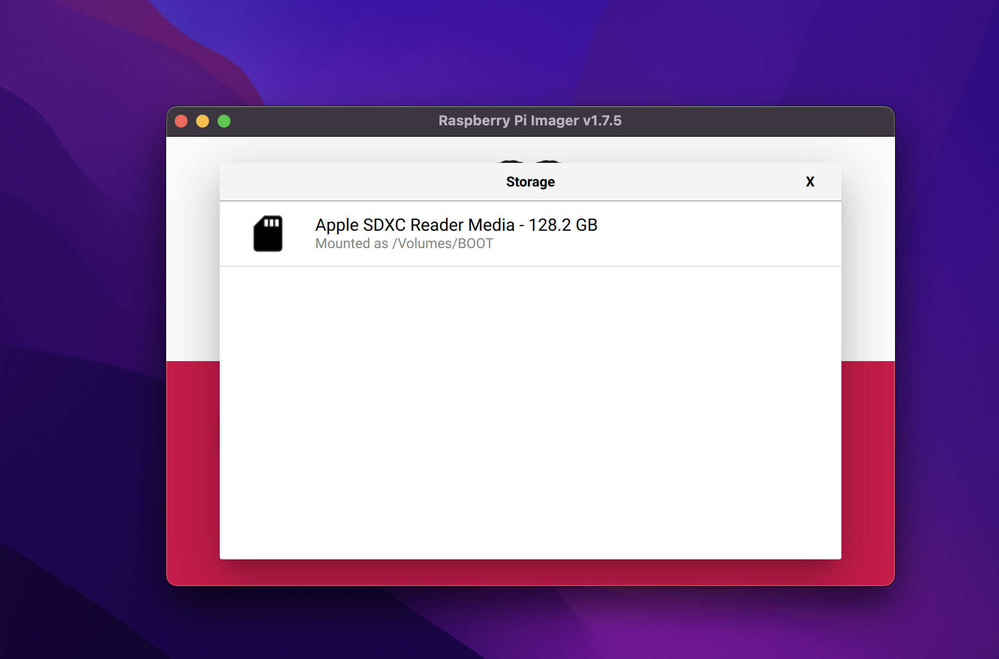

Click `CHOOSE OS`, scroll down and then click Use Custom. Select the previously downloaded Kali Linux image in .xz format (no need to unpack the archive!).
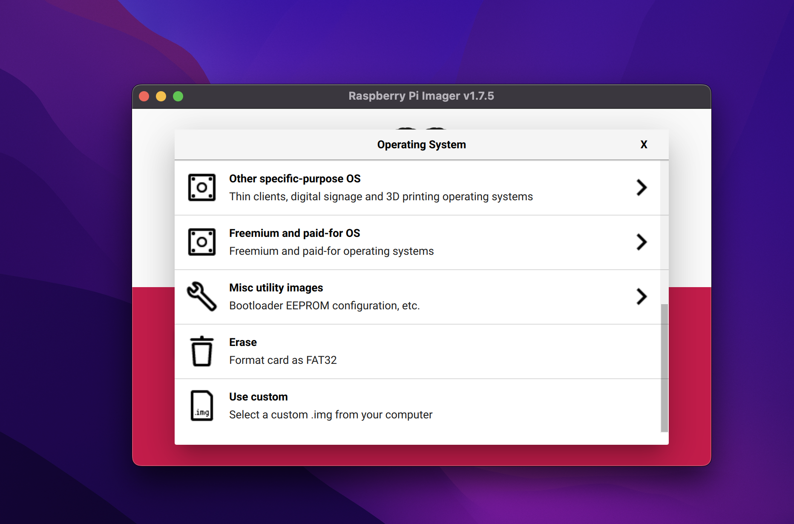

Click on the gear icon and enable SSH.
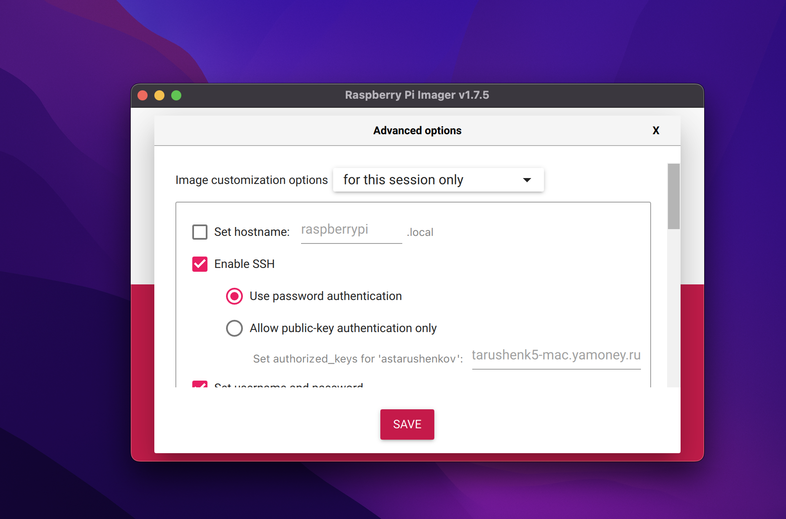

Below in the same section set the login/password. For example you can use kali/kali.
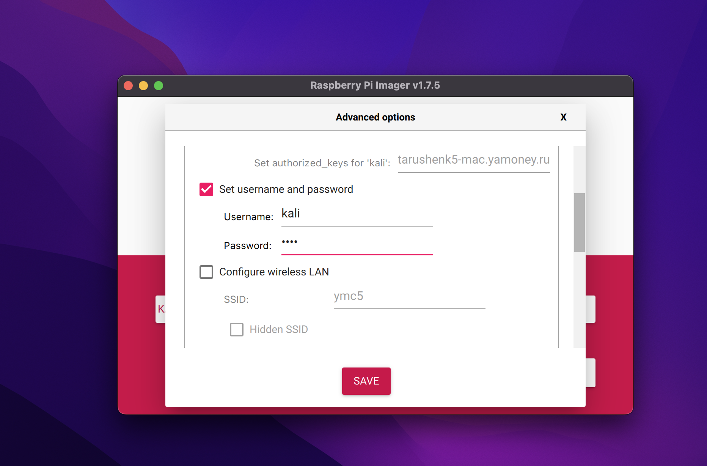

Click `WRITE` and wait for the process of writing the image to the SD card to complete.


When installation is complete, insert the SD card into the appropriate slot on the Raspberry-Pi.

## Installing software
```
sudo apt update && sudo apt install realtek-rtl88xxau-dkms berate-ap lua5.1 alsa-utils triggerhappy curl -y
```

```
wget https://archive.raspberrypi.org/debian/pool/main/r/raspi-config/raspi-config_20160322_all.deb
wget https://archive.raspberrypi.org/debian/pool/main/r/rpi-update/rpi-update_20140705_all.deb
dpkg -i raspi-config_20160322_all.deb
dpkg -i rpi-update_20140705_all.deb
```

## Changing system startup options
### Disabling GUI

```
sudo raspi-config
```

Next in the pseudo graphical interface
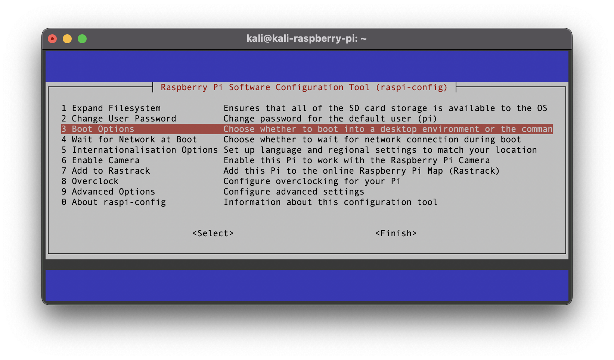
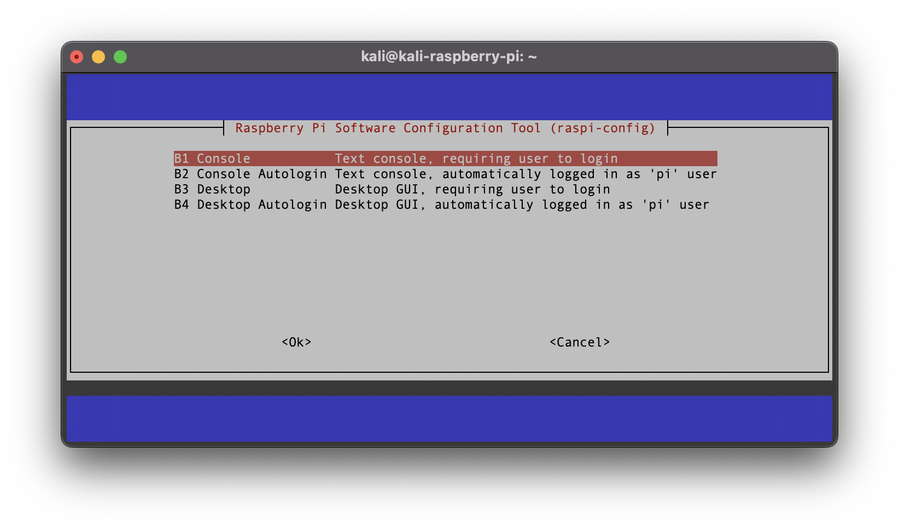

### Waiting for network connection before starting the system
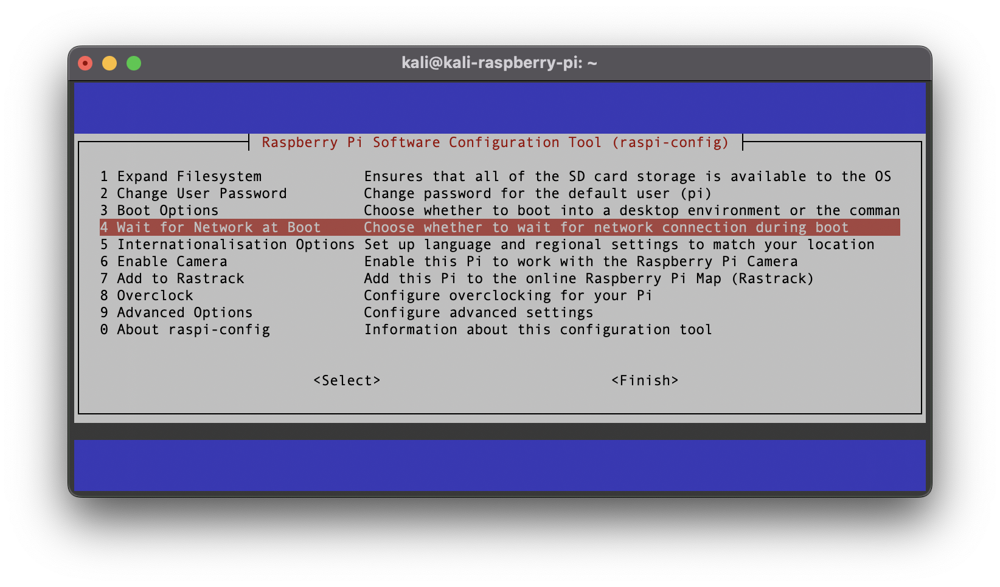
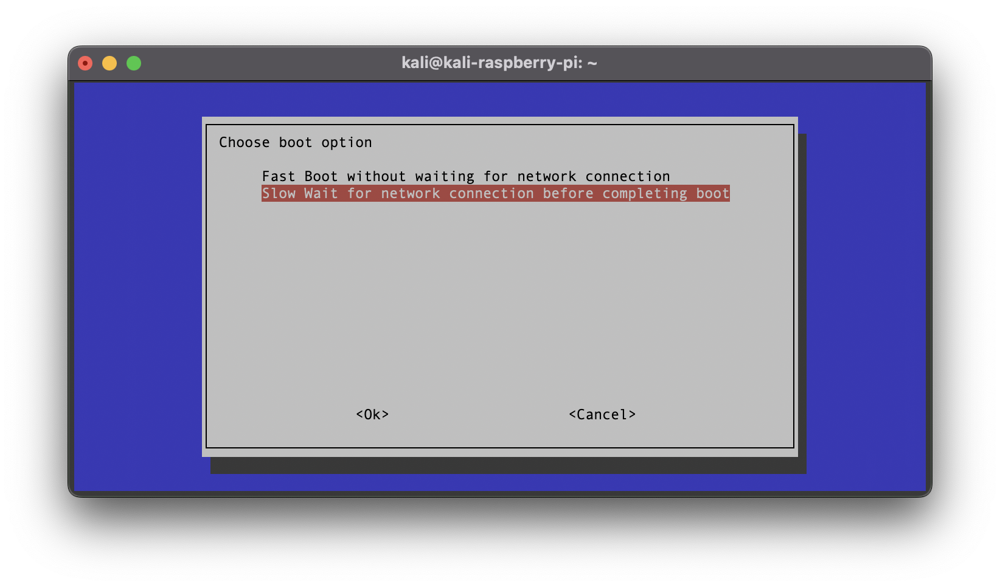

## Setting up a Wi-Fi adapter

Check if the system sees the adapter.
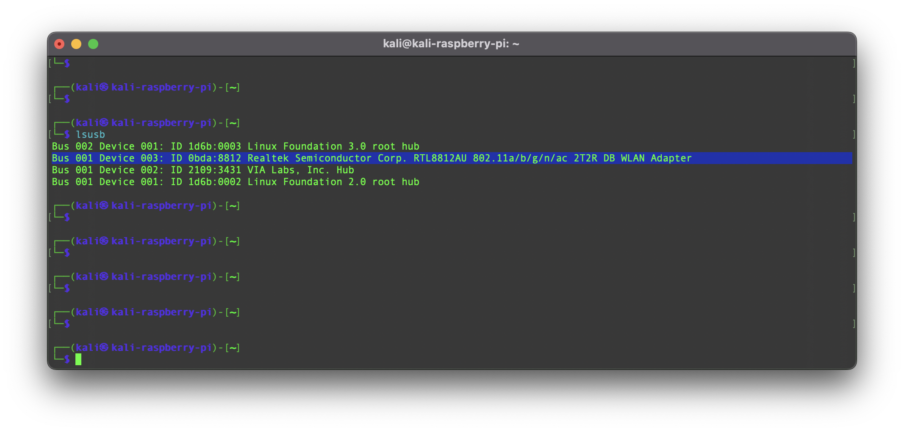

Check adapter works
* If several wlan interfaces are detected in the system, a choice will be offered.
* Success is the continuous operation of the `wifite` utility with targets detection.
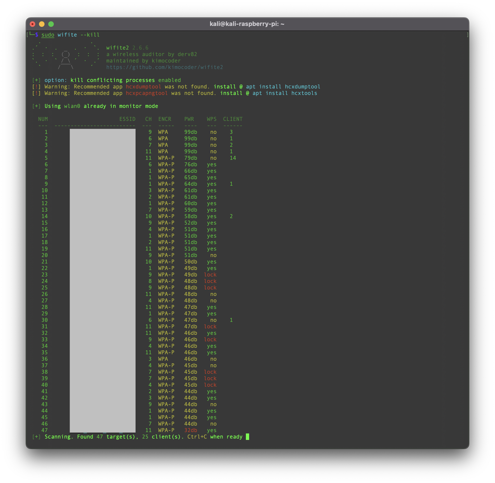

## Setting up automatic launch of Fake Access Point

Creating a directory for logs:
```
mkdir /home/kali/Documents/logs
```

Creating a Fake Access Point script
```
mkdir /home/kali/Documents/script
```

```
touch /home/kali/Documents/script/fap.sh
```

```
sudo chmod 775 /home/kali/Documents/script/fap.sh
```
Script:
```
#!/bin/bash
berate_ap -n wlan1 wlan0 {fap_name} >> /home/kali/Documents/logs/fap.txt
```

Creating a service file:
```
sudo touch /etc/systemd/system/fap.service
```

Service script:
```
[Unit]
Description=fake access point
[Service]
User=root
WorkingDirectory=/home/kali/Documents/script
ExecStart=/home/kali/Documents/script/fap.sh
Restart=always
RestartSec=3
[Install]
WantedBy=multi-user.target
```

Adding a service to autostart:
```
sudo systemctl enable fap.service
```